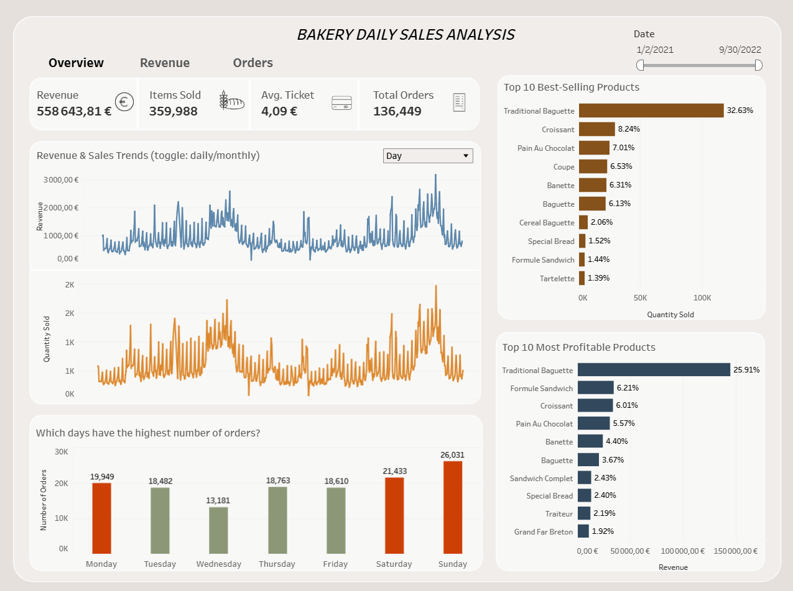

# 📊 Bakery Sales Analysis

## 📌 Project Overview
This project analyzes the daily sales data of a bakery to identify key trends in revenue, sales volume, and customer behavior. The analysis includes an exploratory data analysis (EDA) phase in Python and a Tableau dashboard for visualization. The goal is to derive actionable insights into sales performance, popular products, and seasonal trends.

## 🎯 Objectives
- Perform an Exploratory Data Analysis (EDA) in Python to clean and preprocess the data.
- Identify trends in total revenue, product sales, and customer purchasing behavior.
- Visualize key metrics such as revenue trends, item sales distribution, and product combinations.
- Develop an interactive Tableau dashboard for dynamic insights and trend analysis.

## 🔧 Technologies Used
- **Python** (Pandas, NumPy, Matplotlib, Seaborn) for EDA and data processing.
- **Tableau** for interactive dashboard visualization.
- **Jupyter Notebook** for data exploration and transformation.

## 📂 Data Source
The dataset used for this analysis is available on Kaggle:
[**Bakery Daily Sales Dataset**](https://www.kaggle.com/datasets/matthieugimbert/french-bakery-daily-sales)

## 📊 Tableau Dashboard
The interactive sales analysis dashboard is accessible here:
[**Bakery Sales Dashboard in Tableau**](https://public.tableau.com/app/profile/mariia.nykoniuk/viz/bakerydailysales_17397912303320/Overview)

## 📈 Key Insights from the Analysis
### **1. General Sales Overview**
- The total revenue generated during the analyzed period is **€558,643.81**.
- A total of **359,988 items** were sold across **136,449 unique transactions**.
- The **average ticket value** is **€4.09**, indicating that customers typically spend this amount per purchase.

### **2. Revenue and Sales Trends**
- **Daily and Monthly Trends:** The revenue fluctuates significantly, with noticeable peaks and dips across different time periods. The monthly revenue trend suggests seasonality in customer purchases.
- **Best Revenue Day & Month:**
  - The highest revenue-generating day is **Sunday**.
  - The most profitable month is **August**, suggesting a seasonal peak in sales.
- **Day-wise revenue analysis:**
  - **Friday, Saturday, and Sunday** contribute the most to the revenue, with Sunday leading the sales volume.
  - **Wednesday** has the lowest revenue, indicating lower sales activity.

### **3. Best-Selling and Most Profitable Products**
- The **Traditional Baguette** is the **top-selling product**, accounting for **32.63%** of total sales volume.
- Other popular items include **Croissant (8.24%)**, **Pain Au Chocolat (7.01%)**, and **Coupe (6.53%)**.
- In terms of revenue contribution, **Traditional Baguette leads with 25.91%**, followed by **Formula Sandwich, Croissant, and Pain Au Chocolat**.

### **4. Transactional Behavior**
- The **average number of items per transaction** is **3 items per ticket**.
- The **ticket price distribution** (limited by IQR) reveals that most transactions fall within the **€2.00 - €6.00 range**, indicating an affordable pricing structure.
- **Popular product combinations:**
  - The most frequently purchased product pair is **Coupe & Traditional Baguette**.
  - Other frequent combinations include **Croissant & Pain Au Chocolat**, **Boule 400G & Coupe**, and **Croissant & Traditional Baguette**.

### **5. Sales Distribution Across Time and Days**
- **Sales by Day of the Week:**
  - Sales peak on **Sunday**, with the highest number of transactions and revenue.
  - The lowest number of sales occurs on **Wednesday**.
- **Hourly Sales Trends:**
  - The highest sales volumes occur between **8 AM and 12 PM**, indicating peak bakery hours.
  - During weekdays, sales are consistent but slightly lower than on weekends.
  - On **weekends**, there is a noticeable increase in sales during morning hours, suggesting higher customer traffic.

### **6. Heatmap Analysis (Revenue by Hour and Day)**
- The **heatmap** confirms that sales are concentrated in the **morning to early afternoon hours (7 AM - 2 PM)**.
- Revenue is highest on **Sunday mornings**, aligning with the earlier findings that weekends, particularly **Sunday**, drive the highest sales volume.

### **7. Returns Analysis**
- A total of **1,984 items were returned**, which accounts for **0.55% of all sold items**.
- The return rate is relatively low, suggesting high customer satisfaction or efficient quality control.

### **8. Highest Selling Days**
- The **top five days with the highest quantity of sold items** include August 14, 2022 (1,970 items) and August 15, 2021 (1,725 items), further reinforcing August as the peak sales month.
- The **top revenue-generating days** also include **August 14, 2022 (€3,184.10)** and **July 17, 2022 (€2,656.95)**, indicating these specific dates had special promotions or increased customer traffic.

### **Conclusion**
The analysis provides key insights into revenue distribution, best-selling products, sales trends by day and hour, transaction patterns, and return rates. The **Traditional Baguette** dominates both in sales and revenue contribution, while **weekends, especially Sundays**, are the most profitable days. The seasonal peak in **August** suggests a high demand period, and the transaction values are mostly within the **€2.00-6.00 range**. The low return rate indicates strong product quality and customer satisfaction.

## 🚀 How to Use the Dashboard
1. Use the date filter to analyze sales trends over different time periods.
2. Toggle between daily and monthly views to observe revenue and sales volume trends.
3. Explore the heatmap for insights into peak sales hours and weekday trends.
4. Analyze the histogram to understand the distribution of ticket prices.
5. Review the top-selling and most profitable products to understand customer preferences.
